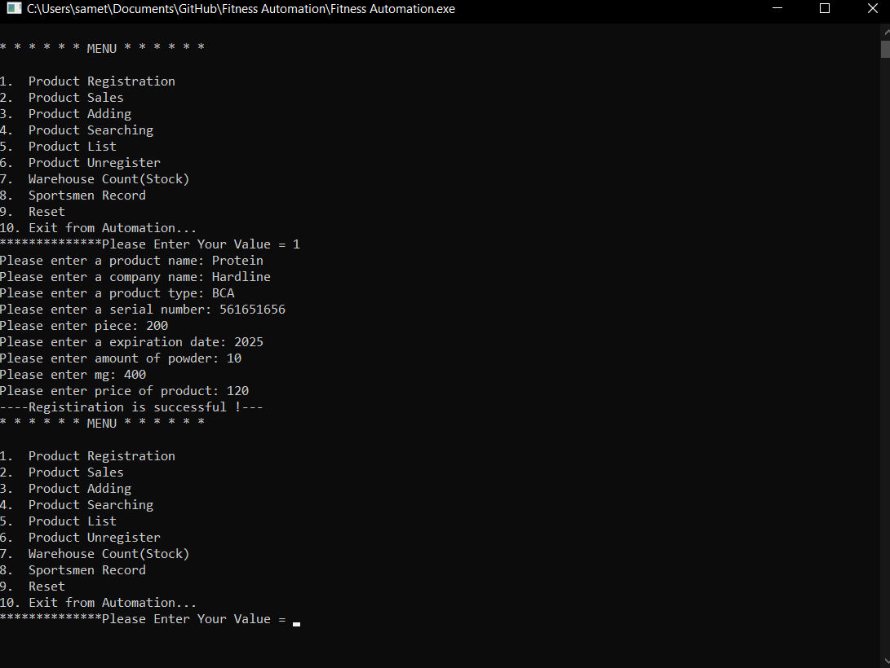

# Fitness Otomation
- Control of incoming products in the gym
- Supply
- Sale of products
- Calculation of the cost of products.
- Creating a new registration, deregistering and logging in to the gym.
- Search for products
- Listing Products
- Updating the Product Quantity
- Reset All Information
 

  

